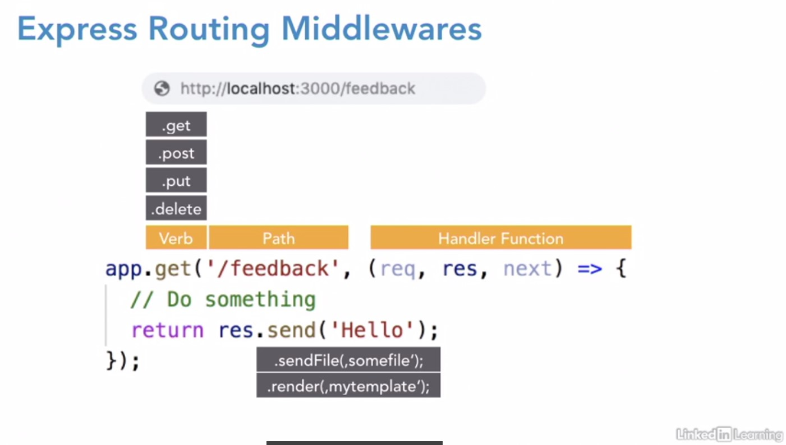

https://www.linkedin.com/learning/building-a-website-with-node-js-and-express-js-3/dynamic-websites-with-node-and-express

EJS  
Motor para el uso de templates, es necesario instalar una extensión para que vsc reconozca los archivos ejs.  
VS Marketplace Link: https://marketplace.visualstudio.com/items?itemName=DigitalBrainstem.javascript-ejs-support  

Middlewares  
    Syntax:  
        app.use(callback);  
        app.use(path, callback);  
        app.[get|post|put|delete|...](path, callback);  
    

app.locals  
The app.locals object has properties that are local variables within the application.  